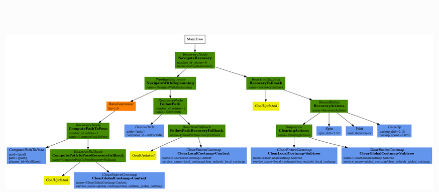
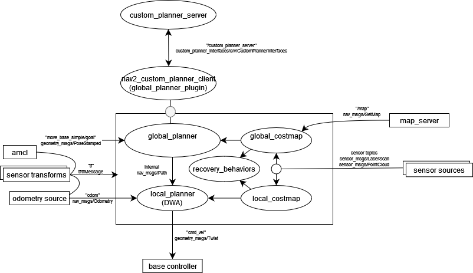
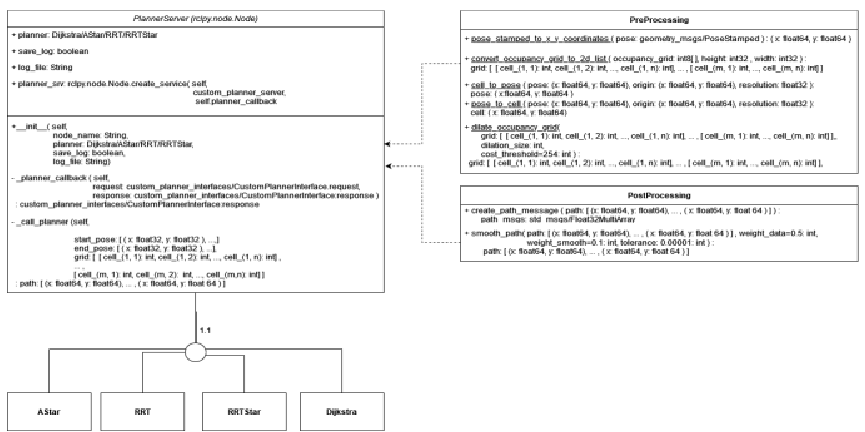

# Custom Planner Plugin

## Introduction

The ROS2 NAV2 stack contains several different behaviours that make up navigation. Each of these behaviours has their own processes that form the logic of how that individual component works. Within ROS, these behaviours are compiled into a tree structure forming a behaviour tree. This creates a human-readable, standardised structure for creating multi-state robotic applications. These behaviour trees are defined in a standardised nav2 format using XML. 

For further information regarding the navigation2 stack, visit [here](https://navigation.ros.org/concepts/index.html#ros-2).

During this project, I have used one of the main behavior trees (BT) used in Nav2, the `bt_navigator/navigate_to_pose_w_replanning_and_recovery.xml`. 

For more information regarding this behaviour tree, visit [here](https://navigation.ros.org/behavior_trees/overview/detailed_behavior_tree_walkthrough.html).



## Goal

The goal of this package was to create a number of nodes to override the Navigation subtree's global planner. This required extensive research and experimentation as this is a niche topic and there are not many examples online. The one example was the [Straightline planner tutorial](https://navigation.ros.org/plugin_tutorials/docs/writing_new_nav2planner_plugin.html) provided by nav2 for creating a plugin for the global planner part of the navigation2 stack. However, even it had issues I had to solve through looking at source code with it saying to update the `nav2_params.yaml` with outdated params:

```yaml
planner_server:
  ros__parameters:
    plugins: ["GridBased"]
    use_sim_time: True
    GridBased:
      plugin: "nav2_straightline_planner/StraightLine" # Incorrct version: plugin: "nav2_straightline_planner::StraightLine"
      interpolation_resolution: 0.1
```
## Additional Research

Additional research into this project revealed that the navigation2 stack uses [pluginlib](https://answers.ros.org/question/357237/writing-a-planner-plugin-for-ros2-using-python/) to dynamically load plugins. However, the navigation2 stack only supports C++ plugins. This posed a challenge as I was implementing this package near the end of the project, having already spent extensive time learning Python rclpy for ROS programming, with no experience in the rclcpp package and limited time to learn.

To overcome this, I decided to create a custom planner client package in C++. This would serve as the nav2 plugin, allowing me to implement my algorithms more simply in C++. I also created a Python node custom planner server. This custom planner server in Python allowed me to easily switch out different algorithm modules with each other, simplifying the experimentation and implementation of new algorithms.

## Navigation2 Lifecycle Diagram



This diagram is based on the ROS2 diagram available [here](https://medium.com/@thehummingbird/navigation-ros-1-vs-navigation-2-ros-2-12398b64cd).

The BT Navigator Server is the entry point hosting the behaviour tree to implement navigation behaviors. Once it receives a goal pose from the user, it orchestrates the navigation task with its behaviour tree. ROS 2 action servers are used to communicate with the BT Navigator through the `navigateToPose` action message to request navigation. In turn, the behavior tree inside also uses subsequent action servers in controller planner, behavior, smoother servers to control efforts, compute plans, perform recoveries, etc. All the ROS 2 managed lifecycles of BT Navigator and subsequent server nodes will step each server through the managed node lifecycle: inactive, active, and finalized.

## CustomPlannerInterfaces/srv/CustomPlannerInterface

```srv
geometry_msgs/PoseStamped start_pose
geometry_msgs/PoseStamped end_pose
nav_msgs/OccupancyGrid occupancy_grid
---
bool success 
std_msgs/Float32MultiArray path
```

## UML of customPlannerServer



## Usage

To launch the navigation stack using the custom planner server, use the command below. Replace `<planner_type>` with your desired planner type (`rrt`, `rrt_star`, `dijkstra`, `a_star`):

```shell
ros2 launch nav2_custom_planner_bringup nav2_custom_planner.launch.py global_planner_type:=<planner_type>
```