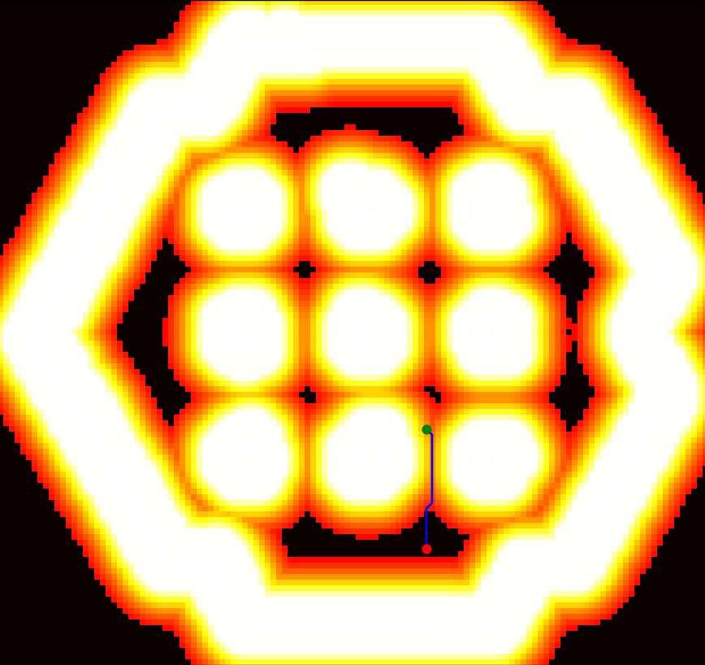

# A* Pathfinding Algorithm

This package contains a custom implementation of the A* pathfinding algorithm. While it can function independently, it is specifically designed for integration with the `custom_planner_pkg`, where it assists the `custom_planner_server` class in generating paths for the navigation2 stack.

The A* algorithm is a popular and efficient pathfinding algorithm used in various fields such as game development and robotics. It uses a best-first search and finds the least-cost path from a given initial node to one goal node. In this case, the Manhattan distance is used as the heuristic, which can effectively reduce the number of nodes that need to be explored, especially in a grid-based pathfinding context.


## Algorithm Implementation

The A* algorithm is implemented as follows:

1. **Initialization**: The AStar class is initialized with a grid and a cost threshold. The grid is a 2D array representing the cost-map, and the cost threshold is the maximum cost of a cell that the algorithm will consider traversable.

2. **Neighbor Calculation**: The `get_neighbors` function calculates the neighbors of a given node. It considers all 8 directions (up, down, left, right, and the 4 diagonals) and checks if the neighbor is within the grid boundaries.

3. **Heuristic Calculation**: The `heuristic` function calculates the Manhattan distance between two points. This is used to estimate the cost from the current node to the goal.

4. **Pathfinding**: The `find_path` function implements the main A* algorithm. It starts by initializing the priority queue with the start node, a set to keep track of visited nodes, a dictionary to keep track of the parent of each node (for path reconstruction), and a dictionary to keep track of the cost from the start to each node.

5. **Looping**: The algorithm enters a loop that continues until the priority queue is empty. In each iteration, it pops the node with the lowest priority (cost + heuristic) from the queue. If this node is the goal, it breaks the loop.

6. **Neighbor Processing**: The algorithm adds the current node to the visited set, gets its neighbors, and for each neighbor, it calculates the tentative cost from the start to the neighbor through the current node. If this cost is less than the previously known cost, it updates the cost and the parent of the neighbor, and adds the neighbor to the priority queue with a priority equal to the cost plus the heuristic.

7. **Path Reconstruction**: If the goal was not reached, the function returns None for both the path and the cost. Otherwise, it reconstructs the path from the start to the goal by following the parent pointers from the goal to the start and reverses it to get the path from start to goal. It then calculates the total cost of the path by summing up the costs of the cells on the path.

8. **Return**: Finally, the function returns the path and its cost.


## Time and Space Complexity

The time and space complexity of the A* algorithm is O(b^d), where b is the branching factor (the average number of successors per state) and d is the depth of the optimal solution. However, these complexities can be significantly reduced if a good heuristic is used.

- Time Complexity: O(b^d)
- Space Complexity: O(b^d)xt.

## Testing

Algorithm testing was done through the creation of the `tests` module, which contains a `test_a_star.py` integration testing class. This class uses the expected params extracted from the navigation stack, including a 2D occupancy grid that is read into this file from the `test_grids/tb3_world_costmap.csv`, which contains all the cell values for the entire cost map from `tb3_world`.

To run the tests, use the following command:

```shell
python3 -m a_star.tests.test_a_star 
```
## Test Results

### Test Output


### Path Outputs from Tests

| Test 1 | Test 2 |
|:------:|:------:|
|  |  |
| Test 3 | Test 4 |
|  |  |
| Test 5 |
|  |

## Test Data

| Test Costs | Test Times |
|:----------:|:----------:|
|  |  |
