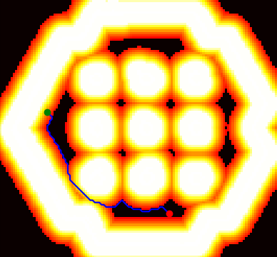
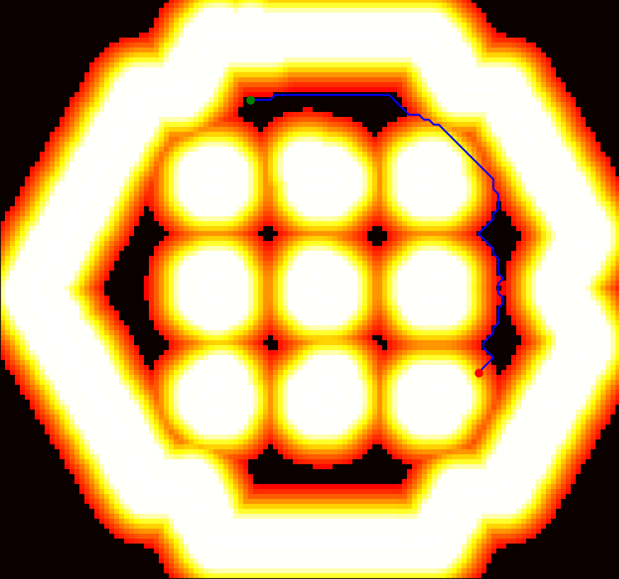
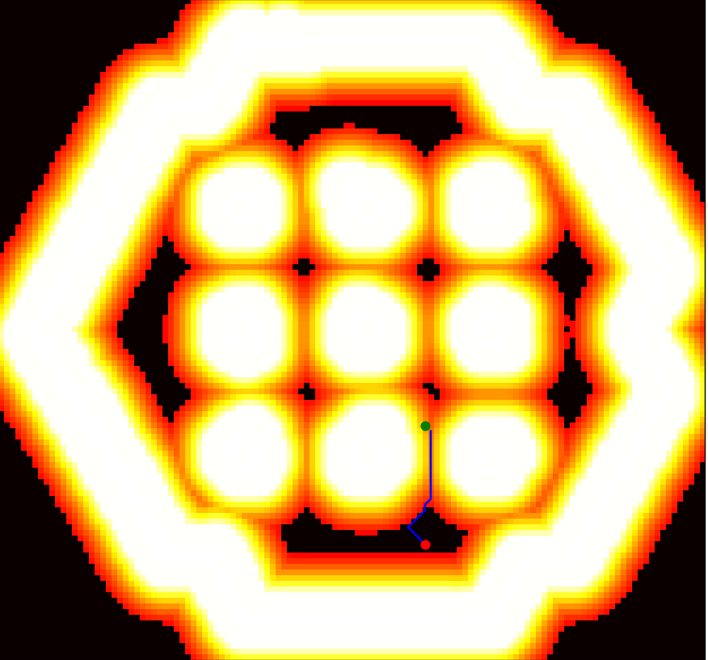
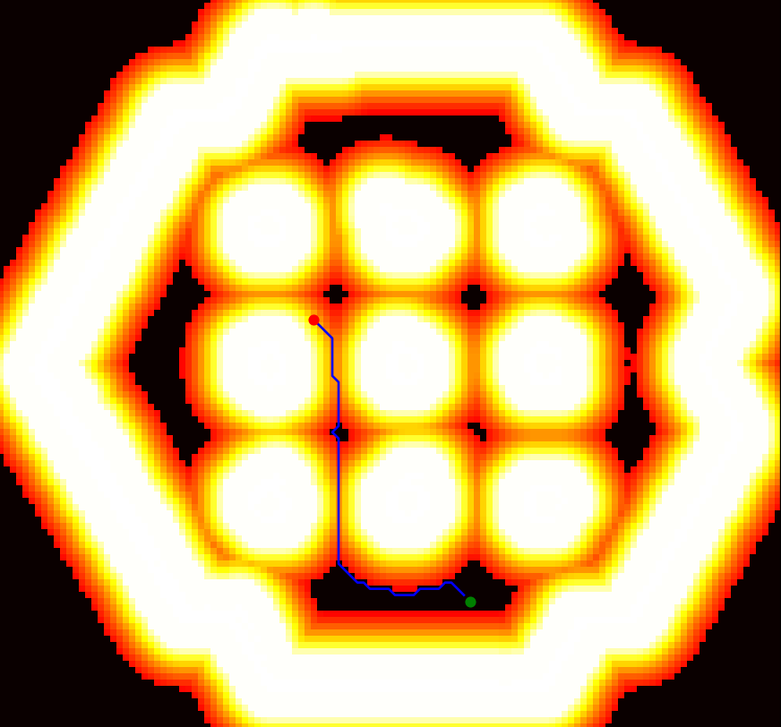
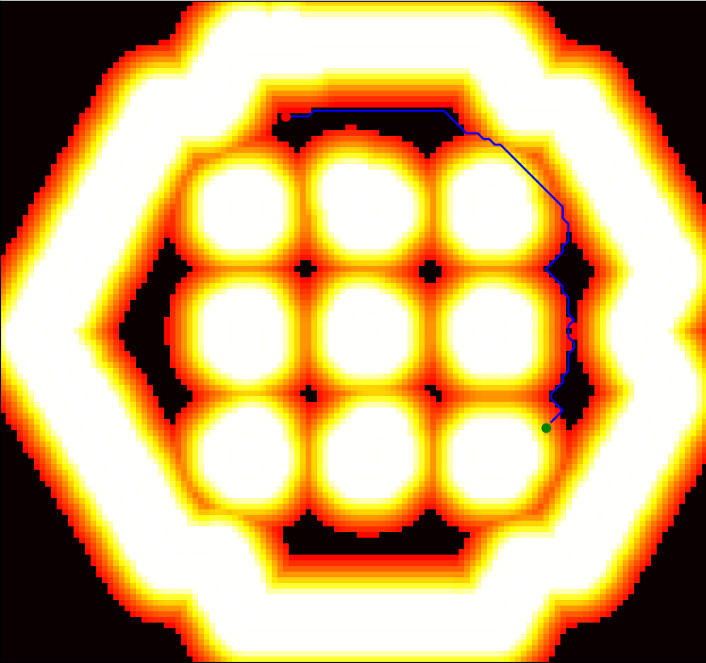

# Dijkstra

This package contains a custom implementation of Dijkstra's algorithm. While it can function independently, it's specifically designed for use with the `custom_planner_pkg`. Dijkstra's algorithm is a pathfinding algorithm that finds the shortest path between a starting node and all other nodes in a graph. It's useful for route planning, navigation, and other applications.

## Algorithm Implementation

The Dijkstra class is initialized with a grid and a `cost_threshold`. The grid is a 2D list representing the map, and `cost_threshold` is the maximum cost that can be accepted for a path.

The `find_path` method is used to find the shortest path from a start point to an end point in the grid. The algorithm uses a priority queue (heap) to always process the point with the smallest cost first, which is the key idea of Dijkstra's algorithm. It also uses a cost threshold to avoid paths with high costs.

### Steps

1. Initialize a heap with a tuple containing 0 (representing the initial cost) and the start point.
2. Initialize two dictionaries, `distances` and `paths`, to keep track of the minimum distance from the start to each point and the path to each point, respectively.
3. Enter a loop that continues until the heap is empty.
4. Pop a point with the smallest cost from the heap.
5. If the popped point is the end point, return the path to the end point and its cost.
6. Generate all neighboring points (including diagonals) and check if they are within the grid and their cost is below the `cost_threshold`.
7. Calculate the cost to reach the neighboring point (the cost of the current point plus the cost of the neighboring point).
8. If the neighboring point is not in the `distances` dictionary or the calculated cost is less than the current cost in the `distances` dictionary, update the cost in the `distances` dictionary, push the neighboring point and its cost into the heap, and update the path to the neighboring point in the `paths` dictionary.
9. If the heap becomes empty and the end point has not been reached, return `None, None`.

### Class UML Diagram


### Time and Space Complexity

- Time Complexity: O((V+E) log V) where V is the number of vertices and E is the number of edges.
- Space Complexity: O(V)

## Testing

Testing was done through the creation of the `tests` module, which contains a `test_dijkstra.py` integration testing class. The tests use expected params extracted from the navigation stack, including a 2D occupancy grid read from `test_grids/tb3_world_costmap.csv`.

To run the tests, use the following command:

```shell
python3 -m dijkstra.tests.test_dijkstra 
```

### Path Outputs from Tests

| Test 1 | Test 2 |
|--------|--------|
|  |  |

| Test 3 | Test 4 |
|--------|--------|
|  |  |

| Test 5 |
|--------|
|  |

## Test Data

| Test Costs | Test Times |
|------------|------------|
|  |  |
