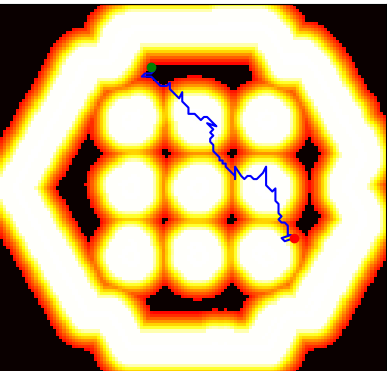

# Rapidly-exploring Random Tree Star (RRT*) Implementation

This repository contains a custom implementation of the Rapidly-exploring Random Tree Star (RRT*) algorithm. The RRT* module can function independently, but it is specifically designed for integration with the `custom_planner_pkg`. It works in conjunction with the `custom_planner_server` class to generate paths for the navigation2 stack.

RRT* is a probabilistic, sampling-based algorithm used for path planning in robotics and autonomous vehicles, among other applications. It randomly samples the search space and builds a tree towards the samples, allowing it to quickly explore large spaces while optimizing the path.

## Algorithm Implementation

The RRT* algorithm is implemented as follows:

1. Node Class: This class represents a node in the RRT tree. Each node has x and y coordinates and a parent node.

2. RRT Class: This class represents the RRT algorithm. It initializes the grid, obstacle threshold, maximum iterations, step size, and a list of nodes.

3. RRTStar Class: This class extends the RRT class and represents the RRT* algorithm. It adds a search radius factor to the RRT class.

4. find_path method: This method finds a path from the start to the end node. It first initializes the start and end nodes and adds the start node to the list of nodes. Then, it iterates for a maximum number of iterations. In each iteration, it generates a random node, finds the nearest node to the random node, and steers towards the random node from the nearest node to generate a new node. If the new node is valid, it adds the new node to the list of nodes, sets its parent to the nearest node, and rewires the tree. If the goal is reached, it constructs and returns the path.

5. rewire method: This method rewires the tree. It iterates over all nodes and if the distance between the new node and a node is less than the search radius, it checks if changing the parent of the new node to the node would decrease the cost. If it would, it changes the parent.

6. get_low_weight_vertex method: This method returns a node with low edge weight.

7. cost method: This method calculates the cost of a path from a node to the root of the tree.

8. distance method: This method calculates the Euclidean distance between two nodes.

9. random_node method: This method generates a random node. It biases towards the goal with a 10% probability and towards low weight vertices with a 10% probability.

10. nearest_node method: This method finds the nearest node to a given node in the list of nodes.

11. steer method: This method steers from a node towards another node with a maximum distance of step size.

12. is_valid_node method: This method checks if a node is valid, i.e., it is within the grid and not in an obstacle.

13. is_goal_reached method: This method checks if the goal has been reached.

14. construct_path method: This method constructs the path from the start to the end and calculates the total cost. It starts from the end and goes towards the start, adding each node to the path and adding the distance to the total cost. It returns the path in start to end order and the total cost.

## Class UML Diagram


## Time and Space Complexity

RRT* algorithm has a time complexity of O(n log n) due to nearest node search and tree rewiring for each new node. Its space complexity is O(n) as it stores all nodes, each with constant data.

## Testing

Testing was conducted through the creation of the `tests` module, which contains a `test_rrt_star.py` integration testing class. This class uses the expected parameters extracted from the navigation stack, including a 2D occupancy grid read from the `test_grids/tb3_world_costmap.csv` file. This file contains all the cell values for the entire cost map from `tb3_world`. Several start and end poses were set to test the reliability of the algorithm in generating paths for this cost map.

To run the tests, use the following command:

```shell
python3 -m rrt.tests.test_rrt _star
```

## Test Results

### Test Output


### Path Outputs from Tests

| Test 1 | Test 2 |
|--------|--------|
|  |  |

| Test 3 | Test 4 |
|--------|--------|
|  |  |

**Test 5**


## Test Data

| Test Costs | Test Times |
|------------|------------|
|  |  |

