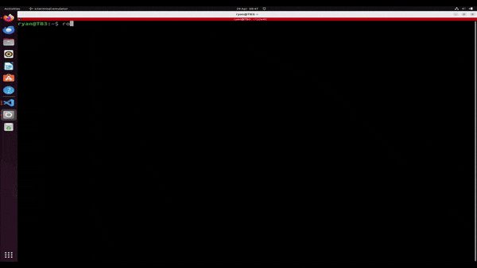

# nav2_custom_planner_bringup

This package facilitates launching the nav2 stack with a custom planner server, providing configuration files and resources necessary for setting up navigation in ROS 2.

## Directories:

- **launch:** Contains essential launch files for both simulation and real-world applications. These files configure and initiate ROS 2 systems, defining nodes, parameters, namespaces, and remappings. Notable launch files include:
    - `bringup_launch.py`: Launches the necessary components for the navigation system.
    - `rviz_launch.py`: Sets up RViz for visualization.
    - `nav2_custom_planner.launch.py`: Launches the custom planner server with configurable parameters, including the type of planner server (e.g., RRT, RRT*, Dijkstra, A*).

- **maps:** Holds directories containing thresholded occupancy grid maps (`map.pgm` and `map.yaml`) generated from SLAM. Sample maps include `tb3_world` for simulation and `real_world` for real-world experimentation, such as the Ashby Building map.

- **models:** Contains URDF and SDF models for robots (`turtlebot3_burger`) and environments (`tb3_world`, `house`) for simulation. URDF and SDF models can be used interchangeably, but SDF provides additional physics information for a more detailed simulation.

- **param:** Contains `nav2_params.yaml` files, configuring navigation components like planners and controllers in the ROS 2 Navigation2 Stack. Additionally, it includes `nav2_custom_global_planner_params.yaml` for custom global planner parameters.

- **rviz:** Stores RViz configurations for robot visualization.

- **URDF:** Holds specific URDF files for different robots in the environment.

## nav2_custom_planner.launch.py arguments

This launch file, `nav2_custom_planner.launch.py`, initializes the navigation system with a custom planner server in ROS 2, providing a wide range of parameters to configure various aspects of the navigation setup. Let's discuss each parameter:

**Common Parameters:**

1. `namespace`: Top-level namespace for the navigation stack.
        - Default: '' (an empty string)

2. `use_namespace`: Whether to apply a namespace to the navigation stack.
        - Default: 'false'

3. `slam`: Specifies whether SLAM should be run.
        - Default: 'False'

4. `map`: Full path to the map file to load.
        - Default: Path to `tb3_world/map.yaml`

5. `use_sim_time`: Specifies whether to use simulation (Gazebo) clock.
        - Default: 'true'

6. `params_file`: Full path to the ROS 2 parameters file to use for all launched nodes.
        - Default: Path to `nav2_custom_global_planner_params.yaml` within the `params` directory.

7. `autostart`: Whether to automatically startup the nav2 stack.
        - Default: 'true'

8. `use_composition`: Whether to use composed bringup.
        - Default: 'True'

9. `use_respawn`: Specifies whether to respawn if a node crashes. Applied when composition is disabled.
        - Default: 'False'

10. `rviz_config_file`: Full path to the RVIZ config file to use.
        - Default: Path to `nav2_default_view.rviz` within the `rviz` directory.

11. `use_simulator`: Specifies whether to start the simulator.
        - Default: 'True'

12. `use_robot_state_pub`: Specifies whether to start the robot state publisher.
        - Default: 'True'

13. `use_rviz`: Specifies whether to start RVIZ.
        - Default: 'True'

14. `headless`: Specifies whether to execute gzclient.
        - Default: 'False'

**Simulation-specific Parameters:**

15. `world`: Full path to the world model file to load (.sdf or .world).
        - Default: Path to `turtlebot3_world.world` within the `worlds` directory.

16. `robot_name`: Name of the robot.
        - Default: 'turtlebot3_burger'

17. `robot_sdf`: Full path to the robot SDF file to spawn the robot in Gazebo.
        - Default: Path to `turtlebot3_burger/model.sdf` within the `robots` directory.

18. `x_pose`, `y_pose`, `z_pose`, `roll`, `pitch`, `yaw`: Initial pose of the robot.
        - Default: x_pose='-2.00', y_pose='-0.50', z_pose='0.01', roll='0.00', pitch='0.00', yaw='0.00'

**Custom Planner Server Parameter:**

19. `global_planner_type`: Specifies the type of global planner to be used by the custom planner server: options (rrt, rrt_star, a_star, dijkstra).
        - Default: 'rrt'

These default values provide a baseline configuration that can be adjusted as needed for specific use cases.

## Sample Use

If the `custom_planner_plugin` package has been built successfully with Colcon and ROS 2 workspace has been sourced (`source ros2_ws/install.setup`), you can run this command:

To run with default RRT planner:
```bash
ros2 launch nav2_custom_planner_bringup nav2_custom_planner.launch.py
```

To customize the default planner, simply include the provided argument. As demonstrated in the preceding section, various other commands are available, with the primary focus being the selection of planner type. Replace <a_star/dijkstra/rrt/rrt_star> with your preferred planner type. Feel free to experiment with these options to fine-tune the navigation system according to your specific needs.

```bash
ros2 launch nav2_custom_planner_bringup nav2_custom_planner.launch.py global_planner_type:=<a_star/dijkstra/rrt/rrt_star>
```

## Bringup launch with default params


